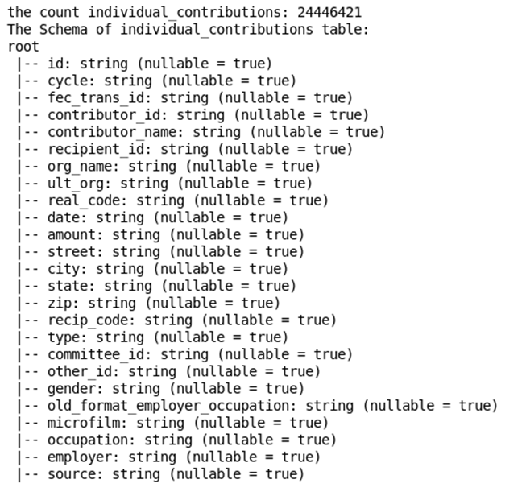

# US Federal Campaign Finance Data 1990–2016 Analysis Project

## Data Source

### Data Context

This includes campaign finance data for all US federal elections (including the every-2-year congressional and every-4-year presidential) from 1990 to 2016. It includes candidate data, PAC data, individual contribution data, PAC to PAC contribution data, and PAC to candidate contribution data, along with political party, industry, sector, and geographical information for the contributions.

### Data Organisation

The data is available in a CSV document. It is 10 csv files for US Federal Campaign individual contributions, as shown in the below table:

|name file| size file| Description|
|-:|-:|-:|
|individual_contributions.csv|5.22GB|Individual Contributions data for all election cycle.|
|industry_codes.csv|40.72MB|The donor's industry or ideology data for individual contributions.|
|backers.csv|14.1KB|Backers' data  in election cycle.|
|candidates.csv|5.78MB| Candidates' data in election cycle.|
|committees.csv|16.95MB|Committees' data in election cycle.|
|fec_api_committees.csv|5.89MB| Updates data on committees for individual contributions for all election cycles.|
|pac_records.csv|4.4MB|PAC data in  election cycle.|
|pac_to_pacs.csv|213.95MB|PAC to PAC contribution data|
|pacs.csv|316.95MB|PAC data in Individual Contributions for election cycle.|
|politicians.csv|828.54KB|Politicians' data in election cycle.|
> 
 Table [1]: Description US Federal Campaign Finance Datasets1990–2016 
 

  

The dataset is available on kaggle web [1].The source of this data is the Bulk data [2]. The following data tables are available for download from Bulk Data Documentation [3]. The Terms of Service for using this data [4].

## Business Value

Since there is a very large file size (more than five gigabytes of 'individual_contributions.csv') in the US federal campaign finance data from 1990–2016, we need to design, implement, and improve the Spark application to answer some interesting questions that we should be able to answer using this dataset:

-	How do the individual contributions of each course evolve over time?
-	How are contributions affected by a presidential election year versus a midterm election?
-	How does the industry or ideology of the donor influence individual contributions?

## Data Process

### Install required libraries

Before installing the library Pyspark, you must execute some instructions:

1. open terminal and run command line `start-all.sh`

2. update bashrc by using command line `vi ~/.bashrc`

3. Add the folowing two lines:

     >  `export PYTHONPATH=$SPARK_HOME/python:$SPARK_HOME/python/lib/py4j-0.10.9-src.zip:$PYTHONPATH`

     > `export PATH=$SPARK_HOME/bin:$SPARK_HOME/python:$PATH"`

4. Hash this line

    >	` # export PATH=$PATH:/home/bigdata/spark/bin`
    
5. Save the changes and exit `vi`, press the `Esc` key to ensure you are in command mode. Then type `:wq` and press `Enter`. This command will write the changes to the file and quit the editor. 

Note:  exit without saving and press esc then `:q!`

To install the library Pyspark, you must run this command:
-	`!pip install pyspark`

### Import libraries

We must run these commands in editor python to perform Spark's core functionalities:
-	import pyspark
-	from pyspark.sql import SparkSession
-	from pyspark import SparkConf
-	from pyspark.sql.functions import col, sum, count
-	from pyspark.sql.types import IntegerType
-	from pyspark.sql.functions import broadcast
-	import time
-	import numpy as np
-	import pandas as pd
-	import matplotlib.pyplot as plt
-	import os

### Spark configuration 

Spark configuration refers to the settings and parameters that can be adjusted to customize the behavior and performance of Apache Spark. These configurations are typically set in the `SparkConf` object before creating a SparkContext.
We used a SparkSession object that provides a unified entry point for working with structured data in Spark. To Increase the memory allocated to Spark: we can allocate more memory to Spark by adjusting the `spark.driver.memory` and `spark.executor.memory` configuration properties, as shown in Figure [2]:

> 
> 
 Figure [2]:  Spark configuration 

  
In Apache Spark, Executors are the worker nodes responsible for executing tasks in parallel. The Executor Memory refers to the amount of memory allocated to each Executor for storing data and executing tasks. The Driver is the program that coordinates the execution of tasks on the Executors. The Driver Memory refers to the amount of memory allocated to the Driver program for storing data and managing the overall execution. In this case, both the Executors and the Driver have been allocated 8 gigabytes of memory each, which means they have a total of 8 gigabytes of memory available for their respective operations.

### Loading the datasets

We have a structured dataset in CSV format with headers and want to leverage the schema inference capabilities of Spark using SparkSession.builder.getOrCreate().read.options(header=True, inferSchema=True).csv(data) would be a suitable approach. This method reads the CSV file into a DataFrame, allowing you to perform structured operations and take advantage of Spark's optimized query execution. We enabled schema inference (`inferSchema=True`) can be convenient, but it requires scanning the entire dataset, which can be time-consuming for large files. 
We created a ‘load_data’ function that takes the data path to load and preprocess the dataset using Spark. And each csv file has a different size, such as ‘individual_contributions.csv (5.22GB)’, ‘industry_codes.csv (40.72MB)’, and others, as shown in the above table [1]. Also, each one will take a particular time to load, as shown in the below Figure [3].

> 

> 
 Figure [3]: Loading csv files by spark dataframe with execution time 

 

As shown in Figure [3], the ‘individual_contributions.csv’ file took 292.29 seconds to load in the Spark dataframe due to its size of 5.22 gigabytes, so we focus on this file that contains more than 24 million records with 25 columns, as shown in Figure [4].

> 
> 
Figure [4]: The schema of individual contributions table

  

Check the null values and duplicated rows
This dataset doesn’t contain duplicated rows. We created the ‘get_null_count_column’ function to get the count of null values in each column of the table, so we applied it to the individual_contributions spark dataframe by using the Fliter method, as shown in Figure [5]. Due to the null values in this large file, the execution time of the operation count is large. To solve this problem, we split this large dataset into two datasets:
1.	The individual contribution dataset doesn't have the committee ID number for the intermediary party to earmark contributions.
2.	The individual contributions dataset has the committee ID number for the intermediary party to earmark contributions.
 	 
 	 
 	 

 

### Data Cleaning: individual contributions datasets

We dropped some columns such as "ult_org", "other_id”, and “old_format_employer_occupation” because they have more than 90% of the null values. We filled the null values by the Fliter method with ‘unknown’ values such as “org_name”, “street”, “city”, “souce”, and others, and dropped the rows with a small count for null values such as “type”, “committee_id”, “cycle”, and others. We applied the statement select to get the unique values of the “cycle” column and discovered the missing value ‘X4000' in this column, so we dropped it from the “cycle” column. We changed the type of “cycle” column from a string to an integer because it contains the federal 2-year election cycle.

## Data Analysis

After applying cleaning to these datasets, we used the aggregation function as a count to get the number of records for each one, so the count of individual contributions that don't have an intermediary party for earmarked contributions is 23224559, and the count of individual contributions that have an intermediary party for earmarked contributions is 1219066.
Using individual contributions datasets, we can answer some interesting questions using these datasets. We applied some the Spark's core functionalities such Aggregations function, Joins, Filtering, Sorting, Grouping by, and others.

### How do individual contributions for each cycle evolve over time?
To answer this question, we got the total amounts for each election cycle that doesn't have the intermediary party's earmarked contributions and has the intermediary party's earmarked contributions as shown in Figure [6] [7].

 

 
 

 

As shown in Figure [8], we notice that the total amounts of individual contributions that don't have the intermediary party's earmarked contributions increase over time (1990–2016), especially between 2010 and 2015.

 

 

As shown in Figure [9], we notice that the total amounts of individual contributions that have the intermediary party's earmarked contributions increased, especially in 2008, by a large percentage (803.86 million).

### How are contributions affected by the presidential election year vs midterms? 

We got the total count for each election cycle that doesn't have the intermediary party's earmarked contributions and has the intermediary party's earmarked contributions as shown in Figure [10] [11].

 	 

 

As shown in Figure [12], we notice that the total count of individual contributions that have the intermediary party's earmarked contributions increased, especially in 2008 and 2012 (345 million and 360 million), and decreased to 675.06 thousand in 2016.
As shown in Figure [13], we notice that the total count of individual contributions that have the intermediary party's earmarked contributions increased, especially in 2012 and 2014 by a large numbers (234 and 282 thousands) and decreased to 124 thousand in 2016.
 

 
 

 

### How does a donor's industry or ideology affect individual contributions?

We got the total amounts for the donor's industry or ideology in individual contributions that don't have the intermediary party's earmarked contributions, and have the intermediary party's earmarked contributions as shown in Figure [14] [15].
 	 

 

 

 
 
As shown in Figure [16], we notice that the code categories (Y4000, X1200, and K1000) of the donor's industry or ideology in individual contributions that don't have the intermediary party's earmarked contributions are more affected because they contributed large amounts, such as 247 billion, 200 billion, and 144 billion as shown in Table [2].

|Code category|	Name category|	Total amounts|
|-:|-:|-:|
|Y4000|	Employer listed but category unknown|	247 billion|
|X1200|	Retired	|200 billion|
|K1000|	Attorneys & law firms	|144 billion|

> Table [2]: The donor's industry or ideology in individual contributions

 

 

As shown in Figure [17], we notice that the code categories (Z9000, Z9999, and Z9500) of the donor's industry or ideology in individual contributions that have the intermediary party's earmarked contributions are more affected because they contributed large amounts, such as 920.71 million, 729.01 million, and 469.60 million as shown in Table[3].

|Code category|	Name category|	Total amounts|
|-:|-:|-:|
|Z9000|	Candidate contribution to his/her own campaign|	920.71 million|
|Z9999|	Internal Transfer and other non-contributions|	729.01  million|
|Z9500|	Transfer from intermediary ( type 24I or 24T)|	469.60 million|
> Table [3]: The donor's industry or ideology in individual contributions

 

## Performance optimization for Spark's core functionalities
We used some techniques to optimize the Spark application for applying some the Spark's core functionalities such Aggregations function, Joins, Filtering, Sorting, Grouping by, and others on large dataset a ‘individual_contributions.csv (5.22GB)’ and decreasing the execution time on the complex operations.

First, we used a Spark DataFrame, allowing us to perform structured operations and take advantage of Spark's optimized query execution because our dataset is a CSV document with a schema. Enabling schema inference (`inferSchema=True`) can be convenient, but it requires scanning the entire dataset, which can be time-consuming for large files, as shown in Figure [3]. We cleaned large dataset such as removing and filling the null values, so we can improve the performance of the Spark's core functionalities.
	Second, we can allocate more memory to Spark by adjusting the `spark.driver.memory` and `spark.executor.memory` by 8 gigabytes configuration properties, as shown in Figure [2].
Third, we used repartitioning, caching, and ordering to help optimize the performance of the operation on the large dataset ‘individual_contributions.csv (5.22 GB), as shown in Figure [18] is a function called "get_Totalcount_cycle" that returns a dataframe containing the total amounts for an election cycle. Here is an explanation of the code:

1.	The function takes two parameters: "df" (the input dataframe) and "number_partition" (the number of partitions to use for repartitioning the dataframe).
2.	Two lists, "presidential_years" and "midterm_years", are defined to store the years of interest for the analysis.
3.	The code filters the input dataframe ("df") based on the "cycle" column, keeping only the rows where the "cycle" value is in the combined list of presidential and midterm years.
4.	The filtered dataframe is then repartitioned into the specified number of partitions based on the "cycle" column.

5.	The start time is recorded using the "time" module.
6.	The repartitioned dataframe is grouped by the "cycle" column and aggregated using the "count" function to calculate the total count of rows for each cycle. The result is stored in a new dataframe called "contributions_by_year".
7.	The "contributions_by_year" dataframe is ordered by the "cycle" column in ascending order and cached in memory for improved performance if the dataframe is reused.
8.	The end time is recorded using the "time" module.
9.	The "contributions_by_year" dataframe is displayed using the "show" method, with the "truncate" parameter set to "False" to ensure that all rows are displayed without truncation.
10.	The execution time is calculated by subtracting the start time from the end time.
11.	The execution time is printed to the console.
12.	Finally, the "contributions_by_year" dataframe is returned as the output of the function.

 

 

When we changed the partition number on a large dataset, we noticed an improvement in the execution time, especially for the 100 partition numbers of this function, as shown in Figure [19].
 
 
 

 

 

 

As shown in Figure [20] that  the function is defined to perform a join operation between two DataFrames, `df_smaller` and `df_larger`, using the column names `name_col_df_smaller` and `name_col_df_larger` as the join keys. The `broadcast` function is used to optimize the join operation by sending the smaller DataFrame (`df_smaller`) to all worker nodes. In distributed computing environments, data is typically partitioned and distributed across multiple worker nodes. During a join operation, the data needs to be shuffled and exchanged between nodes, which can be time-consuming and resource-intensive. By using the `broadcast` function on the smaller DataFrame (`df_smaller`), the DataFrame is replicated and sent to all worker nodes. This ensures that each node has a local copy of the smaller DataFrame, eliminating the need for data shuffling and reducing the amount of data transfer between nodes. As a result, the join operation can be performed more efficiently and with reduced overhead, leading to improved performance and faster execution times. The execution time of the join operation is measured by calculating the time taken from the start (`start_time`) to the end (`end_time`) of the operation. The result is then printed as the "Execution Time for broadcast join" in seconds. After the join operation, the function calls another function `get_Totalamounts_groupBy` to perform a groupBy operation on the joined DataFrame (`joined_df`) using the column `name_col_df_smaller`. The result of this groupBy operation is stored in the DataFrame `df_res_Totalamounts`.

The use of the `inner` join type in this code provides several benefits:

1.	Efficient Data Filtering: The `inner` join type only includes the rows that have matching values in both DataFrames (`df_smaller` and `df_larger`). This ensures that only the relevant data is included in the joined DataFrame (`joined_df`), reducing unnecessary computations and memory usage.
2.	Accurate Results: By using the `inner` join type, the code guarantees that only the rows with matching values in the specified join keys (`name_col_df_smaller` and `name_col_df_larger`) are included in the result. This ensures the accuracy of the joined data, as it eliminates any non-matching rows.
3.	Improved Performance: The `inner` join type typically performs better than other join types (such as `left`, `right`, or `outer`) when dealing with large datasets. Since it only includes the matching rows, it reduces the amount of data that needs to be processed, resulting in faster execution times and improved overall performance.
4.	Simplified Analysis: By using the `inner` join type, the code focuses on the common data between the two DataFrames. This simplifies subsequent analysis tasks, such as grouping and aggregating the data, as it ensures that only the relevant data is considered.

## References
[1] https://www.kaggle.com/datasets/jeegarmaru/campaign-contributions-19902016

[2] https://www.opensecrets.org/

[3] https://www.opensecrets.org/open-data/bulk-data-documentation

[4] https://www.opensecrets.org/open-data/terms-of-service

## Tables
Table [1]: Description US Federal Campaign Finance Datasets1990–2016.

Table [2]: The donor's industry or ideology in individual contributions.

Table [3]: The donor's industry or ideology in individual contributions

## Figures
Figure [1]: Running command line 'start-all.sh'

Figure [2]:  Spark configuration

Figure [3]: Loading csv files by spark dataframe with execution time

Figure [4]: The schema of individual contributions table

Figure [5]: The null values of individual_contributions spark dataframe

Figure [6]: The total amounts for each election cycle that doesn’t have the intermediary party's earmarked contributions.

Figure [7]: The total amounts for each election cycle that has the intermediary party's earmarked contributions.

Figure [8]: Total amount of individual contributions that that don’t have the intermediary party's earmarked contributions over time (1990-2016).

Figure [9]: Total amount of individual contributions that that have the intermediary party's earmarked contributions over time (1990-2016).

Figure [10]: The total count for each election cycle that doesn’t have the intermediary party's earmarked contributions.

Figure [11]: The total count for each election cycle that has the intermediary party's earmarked contributions.

Figure [12]: Total count of individual contributions that that don’t have the intermediary party's earmarked contributions over time (1990-2016).

Figure [13]: Total count of individual contributions that that have the intermediary party's earmarked contributions over time (1990-2016).

Figure [14]: The total amounts for each election cycle that doesn’t have the intermediary party's earmarked contributions.

Figure [15]: The total amounts for each election cycle that has the intermediary party's earmarked contributions.

Figure [16]: the total amounts for the donor's industry or ideology in individual contributions that don't have the intermediary party's earmarked contributions

Figure [17]: the total amounts for the donor's industry or ideology in individual contributions that have the intermediary party's earmarked contributions

Figure [18]: The 'get_Totalcount_cycle' function return dataframe for total amounts for election cycle

Figure [19]: Running The 'get_Totalcount_cycle' function by different numbers of partitions

Figure [20]: The 'get_Totalamounts_BybroadcastjoinTwoTab' uses broadcast joins between two tables to return the total amounts for each column of the broadcast table

